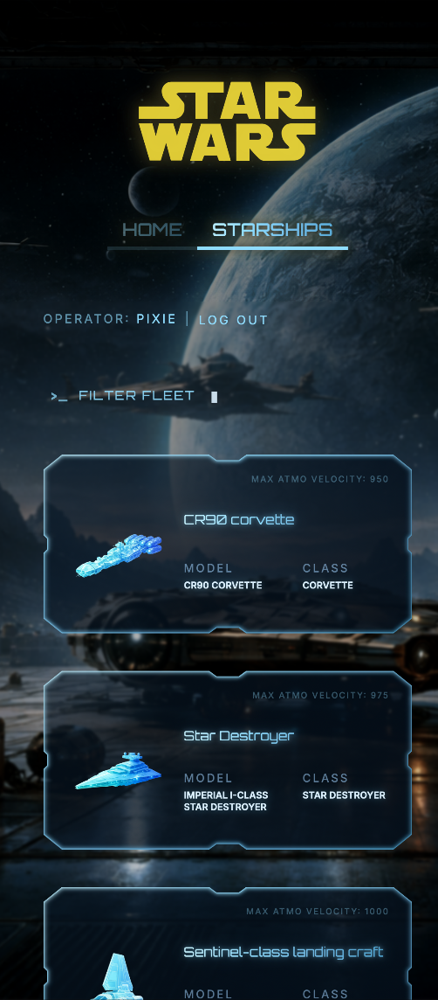
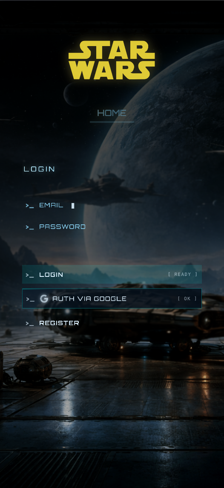

# 🌌 Sprint 7 - Star Wars Starship Database

<div align="center">

**An immersive holographic terminal interface for exploring the Star Wars universe**

[](https://h3llynx.github.io/7.Star-Wars/)
[](https://reactjs.org/)
[](https://www.typescriptlang.org/)
[](https://firebase.google.com/)

</div>

---

## Features

- **Starship Database** - Browse and explore detailed information about iconic Star Wars vessels
- **Smart Filtering** - Real-time search to locate loaded ships by name
- **Secure Authentication** - Firebase-powered login with Google OAuth integration
- **Protected Routes** - Role-based access control using React Router
- **Adaptive UI** - Spaceship HUD interface on desktop, streamlined mobile experience

---

## Project Goals

This project helped me learn || improve my knowledge on:

- **State Management**: Redux Toolkit for global state with TypeScript support
- **Routing**: React Router with protected route implementation
- **React Hooks**: Strategic use of `useState`, `useEffect`, `useRef`, and `useContext`
- **Architecture**: Feature-based folder structure for scalability
- **Responsive Design**: CSS-only responsive layout without frameworks
- **Authentication**: Firebase Auth with Google sign-in and session persistence

---

## Preview

You can try the app via the following link: https://h3llynx.github.io/7.Star-Wars/

1. **Desktop view**:

<div align="left">


</div>

2. **Mobile view**:
<div align="left">


</div>
---

## Quick Start

```bash
# Clone the repository
git clone https://github.com/H3llynx/7.Star-Wars.git
cd 7.Star-Wars

# Install dependencies
npm install

# Start development server
npm run dev
```
---

## 📁 Project Structure
```
7.Star-Wars/
┣ 📂 .storybook/          # Storybook configuration
┣ 📂 public/              # Static assets
┣ 📂 src/
┃  ┣ 📂 app/              # Redux store configuration and App.tsx
┃  ┣ 📂 assets/           # Images and SVGs
┃  ┣ 📂 components/       # Shared UI components
┃  ┣ 📂 context/          # React Context (orientation detection)
┃  ┣ 📂 features/         # Feature-based modules
┃  ┃  ┣ 📂 Auth/          # Authentication (login, register)
┃  ┃  ┣ 📂 StarShips/     # Starship list and details
┃  ┃  ┗ 📂 HomePage/      # Landing page
┃  ┣ 📂 router/           # Route configuration & ProtectedRoute
┃  ┣ 📂 services/         # Reusable API fetch function
┃  ┣ 📂 styles/           # Shared CSS
┃  ┣ 📂 test/             # Vitest test files
┃  ┣ 📄 firebase.ts       # Firebase initialization
┃  ┗ 📄 main.tsx          
┣ 📄 vite.config.ts       
┣ 📄 tsconfig.json        
┗ 📄 package.json
```
---

## 🛠️ Tech Stack

<div align="center">

| Category | Technologies |
|----------|-------------|
| **Frontend** | React 18, TypeScript, CSS3 |
| **State Management** | Redux Toolkit |
| **Routing** | React Router v7 |
| **Authentication** | Firebase Auth (Email/Password + Google OAuth) |
| **API** | SWAPI (Star Wars API) |
| **Build Tool** | Vite |
| **Component Dev** | Storybook |
| **Testing** | Vitest, React Testing Library |

</div>

---

## 🧪 Testing
```bash
# Run unit tests
npm run test

# Launch Storybook
npm run storybook
```

---

## 🤝 Contributions

Contributions are welcome! Please follow these steps to contribute:

1. Fork the repository
2. Create a new branch: git checkout -b feature/NewFeature
3. Make your changes and commit them: git commit -m 'Add New Feature'
4. Push the changes to your branch: git push origin feature/NewFeature
5. Open a pull request

---

<div align="center">

**May the Force be with you** ⚡

Made with 💙 by [H3llynx](https://github.com/H3llynx)

</div>